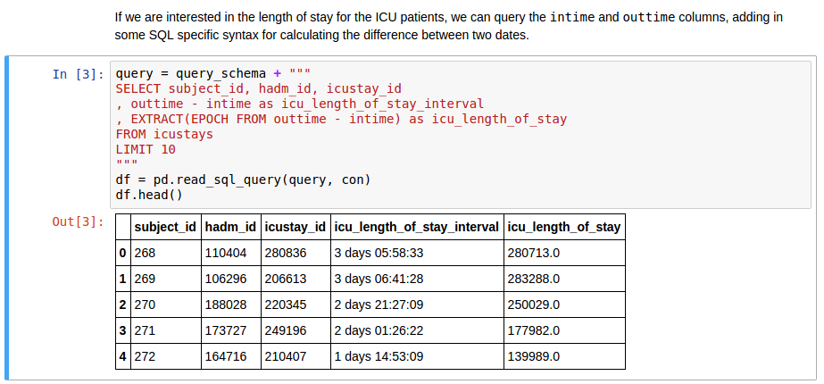
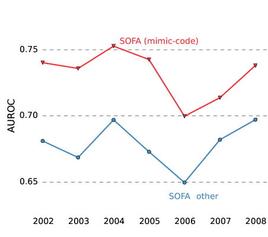

# The MIMIC Code Repository: Towards Reproducibility in Medicine
<!-- Title is max 135 characters incl spaces -->

**Authors:** Alistair E. W. Johnson^1^*, Tom J. Pollard^1^

**Affiliations:**

^1^ Massachusetts Institute of Technology, Cambridge

\* aewj [at] mit [dot] edu

Institute of Medical Engineering & Science
77 Massachusetts Avenue
Cambridge, MA
02139

**One Sentence Summary:** We have released an open source library of medical concepts derived from a publicly available database to accelerate research in critical care.

<!-- Abstract: ~150 words, <250 words. An opening sentence that sets the question that you address and is comprehensible to the general reader, background content specific to this study, results, and a concluding sentence.  It should be one paragraph only. -->

**Abstract:** Less than 20% of decisions made in the intensive care unit are based on evidence. Lack of reproducibility in medical studies further complicates generation of a medical base. We provide a framework for generating completely reproducible studies on an openly available critical care dataset which facilitates rapid testing of hypotheses in a transparent fashion.

<!--
Secondary analysis of routinely collected data - contrasted with the primary analysis conducted in the process of caring for the individual patient - offers an opportunity to extract knowledge that will lead us towards the goal of optimal care. Retrospective studies frequently require similar clinical concepts, so there is benefit in providing open, standardized tools for deriving these concepts to ensure the consistency and efficiency of future studies. We present the MIMIC Code Repository, a collection of open source code for deriving clinical concepts using the MIMIC Critical Care Database. Concepts include severity of illness scores, organ failure indices, and duration of treatments such as ventilation and dialysis. The MIMIC Code Repository is in active development on GitHub. All code is made available under a permissive MIT license unless otherwise indicated.
-->

<!-- Keywords: critical care; open data; data mining; secondary use of electronic health records. -->

<!-- TODO: FIGURE LIST

Figure 1: Jupyter Notebook of demographics tutorial
Figure 2: Block diagram of severity of illness scores and dependencies
Figure 3: Severity of illness score distributions
Figure 4: SOFA old vs. SOFA new
Figure 5: Ventilation duration logic
Figure 6: Duration of mechanical ventilation and vasopressors for one patient
Figure 7: Venn diagram of sepsis

Table 1: Comorbidity frequency
Table 2: Sepsis frequencies

-->

# Introduction

<!--  This should include introductory information that lays out the clinical problem addressed by the research and that explains other background necessary for understanding the study. -->

<!-- TOPICS TO COVER IN INTRODUCTION: -->
<!--  - What is the ICU? -->
<!--  - Why is data in the ICU an important commodity? -->
<!--  - What is MIMIC -->
<!--  - Benefits of creating a centralizing code repository -->
<!--  - What this paper will discuss: results = concepts currently covered, discussion = collaborative goal of the project -->

Recently a number of concerns have been raised around the reproducibility of results in science, particularly in the medical field [?]. The reasons for this so called "crisis" are multifactorial, and include the pressure for obtaining positive results for academic success, the large expense of robust studies such as double blind randomized controlled clinical trials, and the historic lack of openness surrounding medical science [?].
In medicine, the heterogeneity of patient populations presents an additional significant challenge in understanding the relationships between the provision of care and patient outcomes, so much so that the impact of many widely-practiced treatments and interventions remains unknown [REFS: Ioannadis]. Shockingly, it has been estimated that [X in X treatments are not supported by evidence].

<!--  ?? Factoid about lack of openness in medicine??. -->
<!-- We posit that this lack of openness has stymmied progress in the medical field, and fully believe that embracing transparent practices will accellerate research in medicine. -->

An entirely separate revolution has been occurring in parallel to the reproducibility crisis: the digital revolution. In America, the Affordable Care Act has resulted in a remarkable number of hospitals and care institutions transitioning from paper based systems to electronic ones [?]. A similar change in practice at institutions worldwide has also been occurring [?]. Vast quantities of data are now routinely collected by modern hospital monitoring systems and even more so in intensive care units (ICUs) where patients require close observation. There is optimism that increasing availability of large scale clinical databases will offer opportunities to overcome many of the challenges associated with lack of evidence in medical practice [REF: BIG DATA etc].

<!-- Intensive care units care for the sickest patients in a hospital. Often require support for multiple organs. High mortality rate. High rate of sepsis. Potential for improving outcomes... -->

<!-- There is substantial heterogeneity in intensive care populations, particularly in aspects such as patient physiology, presence of disease, and intervention types. -->

The Medical Information Mart for Intensive Care (MIMIC) database is an example of such a data repository [?]. The MIMIC database contains detailed clinical information regarding over 60,000 stays in ICUs located at the Beth Israel Deaconness Medical Center in Boston, MA, USA. MIMIC is publicly accessible, and has been used for a number of clinical studies which provide insight into unanswered medical questions including the association of selective serotonin reuptake inhibitors and mortality [?], the use of indwelling arterial catheters in haemodynamically stable patients [?], and risk factors associated with septic shock [?]. All of the data available in MIMIC is collected passively during routine clinical practice, and the greater penetration of electronic medical record (EMR) systems in hospitals worldwide has the opportunity of spawning many more databases such as MIMIC.

<!-- -->
The use of MIMIC by thousands of researchers around the world has provided a unique perspective on how an openly available dataset can be utilized by the community to provide insight into medical care. Perhaps the most important insight is how challenging research on such a database can be. The use of EMR databases for research is secondary and working with the resultant "messy" data requires close collaboration between both domain knowledge experts and data scientists.
For example, while exact intubation and extubation times are rarely documented in the ICU clinical information system, these times can be inferred by the presence or absence of certain ventilator settings.
Derivation of all these concepts on a clinical database is an energy intensive task and acts as a high barrier to entry for new researchers. Moreover, if not done collaboratively, distinct researchers may define supposedly identical concepts in distinct manners and further complicate comparison among research studies even when done on the same database.

<!--
While the ability to extract key clinical concepts like ventilation durations is valuable for research, a new problem emerges in that distinct researchers may define these clinical concepts differently.
As a result, while two distinct research papers may claim to utilize "length of ventilation" from the same database, the actual values they derive may be substantially different. This variance in the exact calculation of underlying concepts further complicates issues around reproducibility of clinical studies.
Furthermore, even if two researchers are extremely diligent and extract the concept in an identical fashion, the duplication of their effort hinders the overall progress of research in the field.
-->

<!--  Analysis of critical care data often requires definition of clinical concepts, such as severity of illness scores, organ failure indices, and duration of treatments including ventilation and dialysis.Historically, this code has been produced by independent researchers; a process which is time consuming, inefficient, and error-prone. -->

<!-- Typically the code used to generate these concepts is generated by the researcher and often not widely shared for reuse or validation. The result is that work is not easily reviewed and reused, leading to inconsistent approaches between projects, repeated work, and increased probability of errors in the extraction process. -->

<!--  There is a great opportunity for unifying studies on MIMIC with the creation of a centralized repository for data extraction code. Here we describe such a centralized repository, with the hope that is fulfills this need and enhances the reproducibility of research on the MIMIC-III database. -->

<!--  Alistair: this is nice to say but feels a little redundant -->
<!-- The MIMIC Code Repository helps to address these issues by providing a centralised and collaborative codebase for the research community. By allowing researchers to collaboratively develop, share, and review code, the repository helps to standardize the definition of key clinical concepts, promotes continuous review and improvement, and facilitates future studies on the MIMIC-III database. -->

<!--  Analysis of the data collected by these systems has the potential to increase medical knowledge, taking us towards improved care and patient outcomes. -->

This paper proposes a solution to both the issues around reproducibility and the fragmentation of research around medical databases. Namely, we describe the MIMIC code repository, a large body of work which derives a number of clinical concepts in the MIMIC database.
<!--  Some concepts can be difficult or laborious to define but are ubiquitously useful, e.g. severity of illness scores. -->
Detailed descriptions on how the concepts are extracted are provided including what assumptions were made and under what conditions the code is valid for use. The code is open source, follows good coding practices, and can be contributed to by members of the community. The repository also provides a framework for collaboration on medical databases and much of the code can could be adapted for use on other EMR databases.
While the case for open data is well publicized, we believe open code is equally important, and we argue that the use of an openly available repository will accelerate research by improving the efficiency of data extraction and the consistency of future studies.

# Results

There are three components to the repository which maximize the ability of other researchers to use the data and accelerate their research. These components are:

1. Notebooks - easily digestible documents which allow for detailed examination of a study
2. Concepts - coded concepts which are widely required for research studies stored in a modular format
3. Community - encouragement and facilitation of contribution from other members of the community

## Notebooks and tutorials

<!-- Jupyter Notebooks - This section covers the "notebooks" and "tutorials" part of the code repo -->

Notebooks are an amalgamation of text and code, and allow for executable documents which both describe the logic and principles behind the code while simultaneously allowing the user to run the code within the same document. Figure [?] shows an example of a Jupyter Notebook where demographics have been extracted and are displayed for the user to view. Jupyter Notebooks in particular are capable of running code written in many languages including Python, R, MATLAB, SAS, and so on [?]. Other notebook software exists; for example R Notebooks have recently been made available [?].

<!--  TODO: FIGURE jupyter notebook of demographics tutorial -- -->

Notebooks are extremely valuable in cross-disciplinary fields such as healthcare as they facilitate collaboration between data analysts and clinicians.
Notebooks primarily serve three purposes: (i) they allow documentation of the logic behind the code in an organized and easy to read manner, (ii) they aid rapid prototyping of the code particularly during group discussions, and (iii) they provide a means of sharing the final study in a detailed and fully comprehensive manner.

Notebooks are also an excellent environment for publishing tutorials. The alternation between description and code allows for thorough explanation of the subject matter, while the interactive nature of the document allows for experimentation and facilitates learning. A number of tutorials have been made available which elucidate key concepts in working with electronic health data.
The transformation of recorded clinical parameters, such as haemofiltration settings, into desired clinical concepts, such as length of continuous renal replacement therapy (CRRT), is non-trivial and requires both domain and technical expertise. The *CRRT* tutorial overviews the process of examining the database, assessing the data stored within, and producing a robust measure of the clinical concept of interest which in this case was the duration of CRRT.
The tutorial is an excellent starting point for all researchers who work on the secondary analysis of electronic health records, and particularly those who work with the MIMIC-III database. Other tutorials provided include an introduction to Structured Query Language (SQL), how to select a cohort for a clinical study, and an example exploration of common recorded parameters in the database.

## Concepts

The concepts currently available in the repository focus on those which are most broadly applicable to research questions in critical care. For example, severity of illness scores are frequently required to adjust for potential confounding. Concepts are coded in a modular fashion to reduce redundancy in code and allow for extension. An example of the modular nature of the code is shown in Figure [?]. Here, a set of severity of illness scores are shown with their dependency on various clinical concepts. Each clinical concept is modular, and can easily be isolated and utilized on its own, which could occur if for example the researcher is only interested in mechanical ventilation.

<!-- TODO: Figure of blocks showing dependency of various code on other code

[ OASIS ]   [ SOFA ]
    |    \      |
[ MAP ]   [Ventilation]

-->

The following sections describe various concepts currently available in the repository.

### Severity of illness scores

Severity of illness scores have been developed over the past two decades to provide an assessment of the patient's acuity on admission the ICU. The principle aim of these scores is for benchmarking institutions, risk-adjusting patient populations, and comparison of cohorts in clinical trials. In the context of MIMIC, the use of severity of illness scores for risk-adjustment is of highest utility. A number of severity of illness scores are derived, including: the Acute Physiology Score III (APS III) [?], the Simplified Acute Physiology Score II (SAPS II) [?], the Sequential Organ Failure Assessment (SOFA) score [?], the Systemic Inflammation Response Syndrome (SIRS) criteria [?], the quick SOFA (qSOFA) score [?], the Logistic Organ Dysfunction Score (LODS) and a modification of such [?], and the Oxford Acute Severity of Illness Score (OASIS) [?]. The distribution of these scores for adult ICU patients in MIMIC is shown in Figure [?].

<!--  TODO: figure B: severity of illness score distributions -- -->

To highlight the potential discrepency among supposedly identical concepts, we aimed to contrast two versions of the SOFA score: one derived by prior researchers, and one available in the MIMIC code repository.
<!-- [^2]: As our aim is to highlight the potential danger of independent researchers deriving concepts rather than shame others, we have elected not to identify the researchers. -->
Figure [?] shows the area under the receiver operator characteristic curve (AUROC), a measure of the ability for a score to discriminate a dichotomous outcome, for all patients admitted in the MIMIC database between 2001-2008 using the two versions of SOFA.

<!--  TODO: fix figure to only be 2001-2008 -->

The discrepency is likely explained by the data collection of an important variable: the Glasgow Coma Scale (GCS). In the development of the severity of illness scores, scorers were instructed to set GCS to its maximum value (15) if they were unable to assess it for the patient (e.g. due to mechanical ventilation). In the MIMIC-III database the opposite policy is taken: a GCS value of 3 is assigned for patients who cannot be scored with a note indicating if it was due to ventilation.
Accounting for this distinction dramatically impacts the validity of the scores and highlights the need to intimately understand methods of data collection in the domain of interest.

### Organ dysfunction scores

<!-- SOFA, LODS, MELD, RIFLE, KDIGO -->
Organ failure is a hallmark of acute illness and many scores aim to quantify the morbidity for a given patient.
Some scores assess all organ systems: the Sequential Organ Failure Assessment (SOFA) score [REF] and Logistic Organ Dysfunction System (LODS) [REF] both assess six organ systems for failure.
Other single organ failure scores implemented include the Model for End-stage Liver Disease (MELD) [REF], the Risk/Injury/Failure/Loss/End stage renal disease (RIFLE) criteria [REF], the Acute Kidney Injury Network (AKIN) classification [REF], and the Kidney Disease Improving Global Outcomes (KDIGO) criteria [REF]. The latter three scores are all used to assess the level of acute kidney injury in a patient.

### Timing of treatment

The duration of treatment is a useful concept as it quantifies both the intensity of treatment for a patient and provides useful context for other pieces of information: e.g. the use of vasopressors informs the researcher that the blood pressure is being increased by medical intervention. Due to the method of data archival, many medications and treatments are not implicitly stored as durations, and as such they must be derived using sensible rule based approaches. These approaches usually involve identification of surrogate measures which are documented in the data by clinical staff with high compliance. Figure [?] shows a schematic for the derivation of the start and stop times of mechanical ventilation. Similar rules were used to define the timing of vasopressor administration and continuous renal replacement therapy.

<!--  TODO: figure - schematic of ventilation duration logic -- -->

An example of a patient undergoing mechanical ventilation with vasopressor support is provided in Figure [?].

<!--  TODO: figure - duration of mechvent + vasopressor for 1 patient -- -->

### Sepsis

<!--  \emph {The Angus criteria for defining sepsis}: Sepsis is a serious illness caused by infection and is a major focus of clinical research. Angus criteria utilize billing codes to classify a hospital admission as being related to sepsis [REF TO ANGUS], and the criteria have been recently validated [RECENT ANGUS VALIDATION]. -->

<!-- angus, martin, sepsis-3 -->

Sepsis is a majory source of mortality in the ICU, accounting for as much as 30\% of deaths [?]. Research into the effective management of septic patients continues, and the MIMIC code repository provides multiple queries which may accelerate research in this area. The time of suspected infection as defined by the sepsis-3 guidelines is provided [?]. This time is an estimate of when the attending clinician first suspected a patient of infection, and is defined as a blood culture with associated antibiotics. A script for this concept was calculated and a notebook detailing the derivation is also available. In addition, sepsis as defined by ICD-9 codes using retrospective administrative data and validated by Angus et al. [?] was calculated. The ICD-9 codes are assigned retrospectively by hospital staff which involves a review of all relevant patient notes. The definition of sepsis made available aggregated ICD-9 codes which either directly indicated sepsis or at least one organ failure with associated infection. Table [?] shows the percent of patients who were suspected of infection, and the number of patients who had sepsis according to administrative criteria.

<!-- TODO: Figure - Venn diagram of sepsis definitions -->
<!--  TODO: table -->
<!--  who were suspected of sepsis -->
<!--  with a positive blood culture -->
<!--  who had Angus -->
<!--  overlap -->

### Comorbidities

Many critically ill patients present with a number of comorbidities which exascerbate their condition. Elixhauser et al. [?] codified these comorbidities into 29 categories, and a definition of these categories using ICD-9 codes was later published by ??? et al. [?]. The American Health and Research Quality group (AHRQ) continued to maintain these ICD-9 codes, ensuring to adapt them as changes were made to the ICD-9 coding scheme [?]. Quan et al. [?] suggested an alternative definition of these comorbidities which they proposed provided better quantification of comorbid status.
Finally, all of these definitions utilized diagnosis related groups (DRGs) to filter out conditions which were not comorbid but rather the primary reason for ICU admission. These four definitions of comorbidities have been provided in the repository, both with and without DRG filtering.

<!-- FIGURE: bar chart? -->

## Community

Conducting effective clinical research calls for a broad range of knowledge, covering areas such as clinical practice, data collection processes, and analytical methods. For this reason, we believe that it is important to nurture collaboration between disciplines including caregivers, computer scientists, and data analysts.

<!--  Should be developed in collaboration with people who understand the data. Discuss NEJM research parasite paper. The first concern is that someone not involved in the generation and collection of the data may not understand the choices made in defining the parameters. Symbiotic relationship. Closes gap from clinical practice to data analysis. Frequent discussion with hospital staff. -->

<!--  Emphasise that the code will be reused widely in research studies. Also emphasise how much work has gone into creating the code. What are the challenges of creating the scores? -->

<!--  Numerous research studies have been carried out on the MIMIC database in the past, but the code used in analysis has largely been developed independently and often not shared. Lack of code sharing is typical of scientific software development and is a widely recognized issue [Ref: http://www.nature.com/news/2010/101013/full/467775a.html]. By creating the MIMIC Code Repository we have provided a central hub for development of clinical concepts, which we believe will help to standardize and improve future analyses. -->
<!--  The repository is intended to be a continuously developed resource enhancing the sustainability of the code and creating a community around data analysis in MIMIC. -->
<!-- It is typical for PhD or Postdoctoral researchers to write code for a project without thought of long term usage, often leading to unmaintained and unusable code. The MIMIC Code Repository is intended to be a continuously developed resource. We anticipate its importance to grow over time, as the content increases. -->

<!-- A key challenge in developing the code within the repository is in understanding the nuances of the underlying hospital data, so the development process has involved close collaboration between hospital staff and data scientists. This cross disciplinary partnership is facilitated when code is shared openly and developed as a community. Mention how StackExchange is being used for discussion. Has this happened for other research projects? I guess so, but would be interesting to check. -->

# Discussion

This paper has presented a code repository using the MIMIC database which derives a variety of useful clinical concepts. These concepts can, and have been, used for retrospective cohort studies on the MIMIC database. For example, a recent study quantified the recent sepsis-3 guidelines [?]. The study demonstrates how the reuse of code accelerates research: already present concepts which were used by the study include three severity of illness scores, use of mechanical ventilation, and an administrative definition of sepsis validated by Angus et al. [?]. The repository demonstrates how the MIMIC code base can be used to save a great deal of effort in research study and further shows how a snapshot of the MIMIC code repository can be incorporated to ensure future executions of the code return the same result.

The MIMIC database is exceptional due in no small part to its publicly accessible nature: all researchers who undergo human subjects research training and who sign a data use agreement can access the data. Combining this powerful attribute with openly available code results in "executable studies" which can be reproduced by any researcher around the world. Furthermore, the use of Jupyter Notebooks allows the diligent researcher to document both the thought process and the code of any interim analysis they may have performed before reaching their final conclusions. The inclusion of this type of documentation provides other researchers with more confidence in the analysis process and somewhat alleviates the "garden of forking paths" issue recently raised [?].

Contributions to the MIMIC code repository by other researchers who have benefitted from the freely available nature of MIMIC are welcomed, as the ultimate goal of the repository is to build a community of researchers around the database and accelerate research in this field. The use of source code control allows for transparency both in the authorship of the code and in the contributions made by external users.

<!--  Discuss use of code repository and data in university courses. -->

<!-- Because MIMIC is openly available, the entire workflow can be reproduced, from data to publication. Increasing becoming more important to release not only the data but the entire process of idea conception to publication [REF Garden of Forking paths]. -->

<!--  While the case for open data is well publicised, open code is equally important. http://www.nature.com/nature/journal/v482/n7386/full/nature10836.html -->

<!--  We have presented a suite of code simplifying data extraction and facilitating clinical studies. The repository becomes a high-quality resource for researchers in the field. Already used by researchers. X contributors and X forks. -->

<!--  - Open source nature improves validity/allows for community cross-checking -->
<!--  - Tell  'em about your dream Martin! -->

<!-- [Briefly say here that in the past people have not shared their code systematically, which is bad. Leads on to next section.] -->

<!--  Furthermore, many decisions are made when extracting clinical concepts, and these decisions may have a large impact on the resultant analysis. One example is code written to extract the Glasgow Coma Scale (GCS). Severity of illness scores stipulate a value of 15 (``normal'') should be assigned when the GCS cannot be obtained (e.g. due to patient sedation). However, it is common for clinical staff to record values of 3 for the GCS of sedated patients. This results in a systematic bias for sedated patients unless appropriate measures are taken to correct the recorded values. Even if correctly performed, these details would likely be omitted from publications, making study methods difficult to reproduce. -->

<!--  Discuss creating a reproducible workflow for research. -->

<!-- Openly available code is a key step in improving the quality of research as it provides validity to analyses performed and allows progressive improvement of code. While rare in clinical research, the combination of open data and code is powerful. Studies can be made reproducible and code is available to be reviewed and developed. Importantly, open resources such as MIMIC become important learning resources too: there are now multiple university courses around the world in which MIMIC forms a core learning tool. -->

<!-- ## Quality and sustainability -->

<!-- unit tests check the operation of software upon addition of new code to the repository, and a public issue tracker allows research related questions to be raised, encouraging community development and helping to ensure that the code is sustainable [Ref: G Wilson paper]. Often use Jupyter Notebook to create database connection to carry out studies. Continuous review. Services like Github provide incentives for researchers to contribute. -->

<!--  Fully reproducible analytical workflow are encouraged by the openly available nature of both the data and code. -->
<!--  Finally, the code written is modular and generalisable, and may support research in other similarly structured clinical databases. -->

<!-- Conclusion -->

We have described the MIMIC code repository, an openly available set of code which aims to facilitate studies carried out on the MIMIC database. The unique combination of open code with publicly accessible data allows for the creation of fully executable studies with diligent audit trails. The MIMIC code repository contains key clinical concepts necessary for conducting studies and greatly aids in analysis of the data both by providing code for most needed concepts and by fostering a community around the data. Finally, we assert that publishing the code associated with research provides complete reproducibility and will contribute greatly to addressing the issue of replicability frequently discussed in the literature today. Our hope is that both the MIMIC database and the code repository encourage future researchers to follow suite and publish both their code and their data.

# Materials \& Methods

The MIMIC code repository is available online [?] and is open source. Code is available as ISO standard structured query language (SQL) tested with PostgreSQL 9.5.1, Python v2.7.12 scripts, or R v3.2.3 scripts.
Scripts are rewritten to allow an individual who has been granted access to the MIMIC database to generate a number of "views" of the data, with each view being an extraction from the raw data.
Each script is associated with an automatically generated unique hash which acts as an identifier for the code. Publications which utilize the code repository and report this hash allow for other researchers to download an exact copy of the code regardless of any changes made since then. All code follows the principles of good scientific programming as outlined by Wilson et al [Ref: G Wilson paper], including incremental development with a distributed version control system, unit tests, and a public issue tracker.
The repository as of publication was tested on MIMIC-III v1.4.

<!--  - Github. cite github paper. -->
<!--  - Modular approach to generating stuff -->
<!--  - Issue tracking -->

<!--  - Describe the structure of the repository -->

## Data import

A prerequisite for using much of the code in the MIMIC Code Repository is access to the MIMIC-III Database, so we provide scripts to enable researchers to build the MIMIC database in a variety of database systems including PostgreSQL, MySQL, Oracle, and MonetDB.

## Concepts extracted

Clinical concepts which are very commonly required for research studies which have been extracted to date include:

* Demographics such as height, weight, and mortality
* Severity of illness scores and their dependent concepts
* Durations of treatments, including mechanical ventilation, vasopressors, and continuous renal replacement therapy (CRRT)
* Estimated time of first suspicion of infection
* Sepsis as defined by retrospective administrative data [?]
* Comorbidities as defined by administrative data

### Demographics

Demographics were extracted from the administrative data stored in the `PATIENTS`, `ADMISSIONS`, and `ICUSTAYS` table. This data was joined with the primary diagnosis as coded by the by International Classification of Diseases 9th version (ICD-9) codes as available in the `DIAGNOSES_ICD` table.
Demographics extracted included height, weight, age, length of ICU stay, length of hospital stay, ICU mortality, in-hospital mortality, 30-day mortality, first care unit, last care unit, whether the ICU admission is an in-hospital readmission, and principle diagnosis.

### Severity of illness scores

Each score comprises of at least ten independent components. The APS III, SAPS II, SOFA, LODS, and OASIS were calculated using data from the first 24 hours of the patient's stay. SIRS and qSOFA were calculated on admission to the ICU, concretely defined as up to 2 hours after the admission time. Details of score derivation are available in the supplemental material (Appendix A).

<!--  ** This was the original content on SOI scores ** % -->

<!--  Explain importance. -->
<!--  Explain challenges in calculating scores. -->
<!--  Explain code. -->
<!--  Include figure showing... -->

Several scoring systems have been developed in order to quantify extent of illness in hospital patients [REF]. These scoring systems are used widely in secondary analysis of health data for a variety of purposes, including selection of study populations and as covariates for severity adjustment in physiological models. While severity scores are integral to many research studies, their definition can present several challenges and it is crucial to recognise the limitations of how scores are generated. Firstly, for example, most severity scores are developed with well curated datasets, usually acquired either through prospective data collection by trained personnel or through manual data abstraction by qualified professionals. As a result, the data tends to be cleaner and often has, perhaps more importantly, a distribution that is markedly different from routinely collected data such as that present in an electronic health record.

Secondly, routinely collected data often lacks some of data elements required to compute the score. For example, the comorbidity ``''biopsy proven cirrhosis``'' is not simple to determine as there is no routine documentation of this concept in the clinical workflow. Finally, the data definitions for the same concept can vary between the original dataset used to define the severity score and the electronic health records being analyzed. For example, the Glasgow Coma Scale (GCS), a common marker of neurological dysfunction which ranges from 3 (worst) to 15 (best), is usually assumed to be 15 for patients who are unable to be assessed due to sedation or ventilation. In an electronic health record however, this definition is not strictly adhered to as there is no defined protocol, and as a result sedated patients may be assigned a score of 15 by some care providers, and a score of 3 by others.

Working directly with caregivers has helped us to address these issues in the code, helping to ensure the derived severity scores accurately reflect the true severity of illness in patients. There are five severity of illness scores currently implemented in the MIMIC Code Repository: APS-III [REF aps], SAPS [REF saps], SAPS-II [REF sapsii], SOFA [REF sofa] and OASIS [REF oasis]. A more detailed comparison of the severity scores is provided in the supplementary material, along with discussion of the assumptions that have been made when defining severity scores. An example of the importance of the variance caused by a non-centralized code base is shown in \ref{fig:SevScoresOverTime}, where the performances of two different implementations of the SOFA score in discriminating hospital mortality are shown. Both of these implementations have been used in previous publications.

<!--
#### Duration of interventions
-->

<!--  Explain importance. -->
<!--  Explain code. -->
<!--  Include figure showing data points vs derived duration. -->

<!--  ** This is older written content on treatment durations ** %

**Treatment durations**: Studying the effect of treatments on patient health is of great interest, though deriving the timing of these treatments from a database can be non-trivial. We provide views with (i) vasopressor use start and stop times for all vasopressors and individual medications and (ii) mechanical ventilation start and stop times. The duration of these interventions is also a useful measure of treatment intensity.

When carrying out a study it may be necessary or desirable to know the durations of interventions and physiologic states such as mechanical ventilation, vasopressor administration, and hypotension. Deriving these durations from routinely collected data is often non-trivial, requiring a strong understanding of the underlying data as well as the environment in which it was collected. Cao et al highlight this issue in a 2010 paper on heuristics to determine ventilation times of ICU patients, noting that while ``''On the surface, it appears trivial to determine ventilation times``'', ``''when facing the reality of retrospective data, it is not straightforward``'' [REF Cao et al 2010]. In collaboration with staff at the Beth Israel Deaconess Medical Center - the primary source of data in the MIMIC-III database - we have provided code to derive start and stop times for continuous events such as mechanical ventilation, dialysis, and various vasopressors.

Taking invasive mechanical ventilation as an example, intubation and extubation times are not well documented, so they are determined through the use of surrogate settings which are synchronized with the patient's chart via the ventilator. These settings include flow rates, tidal volumes, and so on. The key assumptions made when defining ventilation are: start time of ventilation is the first occurrence of a ventilator setting, and end time of ventilation is the time of a ventilator setting, followed by at least 8 hours of no ventilator settings. Consequently, short extubations (\<8 hours) are not captured by the ventilation query, and the end time of ventilation only approximates the actual extubation time. An example of these durations is provided in Figure \ref{fig:treatment}.
-->

<!--
## Clinical guidelines and definitions of disease
-->
<!--  Explain importance. -->
<!--  Explain code. -->
<!--  Include figure, perhaps cluster. -->

<!--
Numerous clinical guidelines have been developed by well-recognised experts and organisations to assist in the identification and management of specific clinical conditions. These guidelines are often used in clinical studies for risk adjustment and for selection of patient cohorts. One clinical definition implemented in the MIMIC Code Repository, for example, is Angus criteria. These criteria are a widely used definition of severe sepsis, a high-risk complication of infection that consumes considerable healthcare resources and is strongly associated with patient mortality, with a 2001 paper attributing ~215,000 deaths from severe sepsis in the US annually [REF - Angus 2001]. The Angus criteria are based upon hospital billing codes, making them relatively simple to implement, but other guidelines are less straightforward.

The Glasgow Coma Scale (GCS), for example, represents the level of conciousness of a patient, and as such it is influenced by level of sedation. In the collection of data for severity scoring, values of GCS were set to 15 (normal) if the care provider felt the GCS was not a true reflection of the patient's neurological status. This situation would occur if the patient was sedated or if a tracheostomy prevented a verbal response. However, these values in MIMIC-III are often recorded as 3 (extremely abnormal) - in particular, the string for verbal response can be either ``''1.0 No response``'' or ``''1.0 ET/Trachy``''. Simply extracting the GCS as it appears in MIMIC would be incongruent with the original definition of the scale and would likely compromise their discrimination and calibration. Ideally, all patients who have low GCS due to sedation would have their value replaced by 15, but in practice determining sedation status from a patient's chart is a difficult task.

In addition to implementing code for the Angus criteria for severe sepsis and Glasgow Coma Scale for neurological status, we provide scripts for a growing number of additional clinical guidelines. These include the Kidney Disease: Improving Global Outcomes (KDIGO) classification for acute kidney injury, a common, harmful, and potentially treatable condition characterised by abrupt decrease in kidney function [REF - KDIGO guidelines], as well as the Model For End-Stage Liver Disease (MELD) Score, which is commonly used in the care of patients with cirrhosis for assessing the severity of chronic liver disease. Critically ill patients frequently have many comorbidities which influence both their overall health and their trajectory of health during an individual hospital stay. To support analysis that seeks to capture the variation in patient comorbidities, the MIMIC Code Repository includes code for computing the Elixhauser Comorbidity Index, a clinical definition that seeks to summarize the level of comorbidities in individual patients using billing codes collected at hospital discharge [REFS].
-->

<!--  figure figures/SOFA.eps -->
<!--  fig:SevScoresOverTime -->
<!--  Discrimination of two implementations of SOFA across fiscal years as measured by the area under the receiver operator characteristic curve (AUROC). -->

# Supplementary Materials

<!-- [Present a list of the titles of the Supplementary Materials, in the following order: Supplementary materials and methods, supplementary figures, supplementary tables, other supplementary files, such as movies, data, interactive images, or database files. Be sure to submit all Supplementary Materials with the manuscript.] -->

# References and Notes

**Acknowledgments:** The authors would like to thank Professor Roger G. Mark, the MIT Laboratory for Computational Physiology, Philips Healthcare and the Beth Israel Deaconess Medical Center for the creation of the MIMIC-III database.
**Funding:** This work has been supported by grants NIH-R01-EB017205, NIH-R01-EB001659, and NIH-R01-GW104987 from the National Institutes of Health.
**Author contributions:** AEWJ and TJP collaborated to build the MIMIC code repository and write the paper.
**Competing interests:** None.
**Data and materials availability:** <!-- TODO: github hash? "If data are in an archive, include the accession number or a placeholder for it." -->

# Figures
<!-- Note: maximum of 8 figures -->
