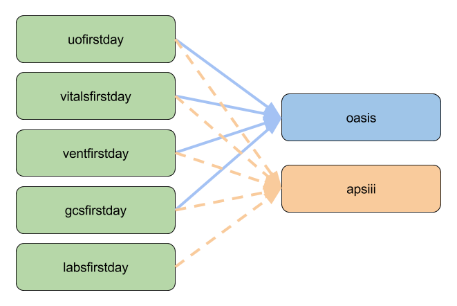

# The MIMIC Code Repository: Towards Reproducibility in Secondary Analysis of Health Records

<!-- The title should ideally be fewer than 120 characters, with a clear indication of the biological system under investigation (if appropriate), and should avoid abbreviations and unfamiliar acronyms if possible. Please note that two-part titles – e.g. “What goes up must come down: Oscillations in transcriptional networks” – are not permitted for research papers. -->

**Authors:** Alistair E. W. Johnson^1^\*, David J. Stone^2^, Leo Anthony
Celi^1,3^, Tom J. Pollard^1^

**Affiliations:**

^1^ Massachusetts Institute of Technology, Cambridge

^2^ University of Virginia School of Medicine, Charlottesville

^3^ Beth Israel Deaconess Medical Center, Boston

\* aewj \[at\] mit \[dot\] edu

Institute of Medical Engineering & Science 77 Massachusetts Avenue
Cambridge, MA 02139

<!--
**One Sentence Summary:** We have released an open source library of
concepts related to critical illness derived from a publicly available
database to accelerate research.
-->

<!--
The abstract should be fewer than 150 words and should not contain subheadings. It should provide a clear, measured, and concise summary of the work. If the biological system (species names or broader taxonomic groups if appropriate) is not mentioned in the title, it must be included in the abstract.
-->

**Abstract:** Lack of reproducibility in medical studies complicates
generation of the knowledge base to support clinical decision-making. We
provide a framework for generating reproducible studies on an openly
available critical care dataset, which facilitates testing of hypotheses
in a transparent fashion.

<!-- Keywords: critical care; open data; data mining; secondary use of electronic health records. -->

<!-- TODO: FIGURE LIST

Figure 5: Ventilation duration logic
Figure 6: Duration of mechanical ventilation and vasopressors for one patient
Figure 7: Venn diagram of sepsis

Table 1: Comorbidity frequency
Table 2: Sepsis frequencies

-->

# 1. Introduction

Recently a number of concerns have been raised around the reproducibility of results in science, including work in the biomedical field \[John Ioannidis “Why Most Published Studies are False”\]. The reasons for this perceived crisis are multifactorial, and include the pressure to publish positive results, the cost of replicating studies such as double blind randomized controlled clinical trials, and the lack of emphasis on reproducibility as a requirement for sound science \[Leo Anthony Celi “Beyond Open Data”\]. In medicine, the heterogeneity of treatment effect across subpopulations presents an additional challenge in the evaluation of interventions \[reference\]. For all these reasons, the risk-benefit profile of many widely-practiced treatments and tests remains unknown \[reference\].

An entirely separate phenomenon has been occurring in parallel to the reproducibility crisis: the digital revolution. The Health Information Technology for Economic and Clinical Health Act has catalyzed the transition of hospitals and care institutions from paper based systems to electronic ones \[?\]. Vast quantities of digital data are now routinely collected by modern hospital monitoring systems, even more so in intensive care units (ICUs) where patients require close observation. There is optimism that increasing availability of large scale clinical databases will offer opportunities to overcome many of the challenges associated with lack of evidence in medical practice \[REF: BIG DATA etc\].

The Medical Information Mart for Intensive Care (MIMIC) database is an example of such a data repository \[?\]. The MIMIC database contains detailed clinical information regarding over 60,000 stays in intensive care units (ICU) at the Beth Israel Deaconess Medical Center in Boston, MA, USA. MIMIC is publicly accessible, and has been used for a number of clinical studies \[?\]. All of the data available in MIMIC is collected as part of routine clinical care in the ICU: the greater penetration of electronic health record (EHR) systems in hospitals worldwide presents the opportunity to spawn many more of such databases.

The use of MIMIC by thousands of researchers around the world has provided a unique perspective on how an open dataset can be shared by a research community. Perhaps the most important insight since the database was made open-access is how challenging research using EHR can be, requiring close collaboration between domain experts and data scientists.

<!--
For example, while exact time stamps for initiation and
discontinuation of mechanical ventilation are rarely documented in the
ICU clinical information system, these times can be inferred by the
presence or absence of mechanical ventilator settings.
-->

Derivation of key clinical concepts on an EHR database is a resource-intensive task, and is a significant barrier to those unfamiliar with the clinical environment. Moreover, if concepts are not defined collaboratively with those who are familiar with the workflows, including how the data is captured, the validity of any findings becomes suspect.

In this paper, we describe the MIMIC code repository, a large body of work which derives concepts that are relevant to critical care research. Detailed descriptions on how the concepts are defined and extracted from the database are provided, including the assumptions that are made and the conditions for which a code or query is valid. The code is open source, follows good documentation practices, and is contributed to by members of the research community using MIMIC. The repository provides a framework for collaboration around research. While the case for open data has been already been strongly made \[references\], we believe *open code* is equally important. We would make the argument that the use of an openly available code repository will improve secondary analysis of health data by accelerating the understanding of datasets by researchers, and improving the consistency and validity of future
studies.

# 2. The MIMIC Code Repository

The MIMIC code repository is available online \[?\] and is open source. Code is available as ISO standard structured query language (SQL) scripts tested with PostgreSQL 9.5.1, Python v2.7.12 scripts, or R v3.2.3 scripts. Scripts are modified to allow an individual who has been granted access to the MIMIC database to generate a number of "views" of the data, with each view being an extraction from the raw data. Each script is associated with an automatically generated unique commit hash that acts as an identifier for the code. Publications that use the code repository can further cite the commit hash, allowing other researchers to download a copy of the code used regardless of any modifications since. All code follows the principles of good scientific programming as outlined by Wilson et al \[Ref: G Wilson paper\], including incremental development with a distributed version control system, unit tests, and a public issue tracker. The repository was tested on MIMIC-III v1.4 at the time of this publication.

A prerequisite for using much of the code in the MIMIC code repository is access to the MIMIC-III data in a relational database. The MIMIC code repository further provides scripts for building said database using a variety of database management systems including PostgreSQL, MySQL, Oracle, and MonetDB.

There are three components to the repository that facilitate navigation of the data for research purposes. These components are:

1. Notebooks: documents of the design and methodology employed in analyses using MIMIC, including published studies
2. Concepts: definitions of concepts as well as queries to extract them from MIMIC, stored in a modular format. For example, the module on acute kidney injury (AKI) uses the criteria as specified by the Kidney Disease Improving Global Outcomes (KDIGO) and provides the code to identify patients with AKI in MIMIC. More examples are given below.
3. Community: public discussions to facilitate contributions from members of the MIMIC research community

## 2.1 Notebooks and tutorials

Notebooks are an amalgamation of text and code, sometimes classified
as a form of literate programming. Notebooks are essentially executable
documents; they allow for seemless description of the logic and principles
behind the code while simultaneously being capable of executing code blocks.
Figure \ref{fig:tutorial} shows an example of a Jupyter Notebook where
demographics have been extracted and are displayed for the user to view.
Jupyter Notebooks in particular are capable of running code written in
many languages including Python, R, MATLAB, SAS, and others \[?\]. Other
notebook software exist; for example R Notebooks have recently been
made available \[?\].

{ width=100% }

Notebooks are extremely valuable for research in cross-disciplinary fields such as healthcare as they facilitate collaboration between data analysts and domain experts. Notebooks primarily serve three purposes: (i) they allow documentation of the logic behind the code in an organized and easy to read manner; (ii) they aid rapid writing of the code particularly during group discussions; and (iii) they provide a means of sharing details of a published study that captures the learning that takes place during the evolution of a research project.

Notebooks are also an excellent platform for tutorials. The alternation between description and code allows for thorough explanations of the subject matter, while the interactive nature of the document allows for experimentation and facilitates learning. A number of tutorials have been made available which elucidate key concepts in working with MIMIC. The transformation of recorded clinical parameters, such as hemofiltration settings, into desired clinical concepts, such as length of continuous renal replacement therapy (CRRT), is non-trivial and requires both domain and database expertise. The *CRRT* tutorial overviews the process of exploring MIMIC, assessing the data stored within and producing a measure of the clinical concept of interest (duration of CRRT). The tutorial is an excellent starting point for all researchers who work on the secondary analysis of electronic health records. Other tutorials in the MIMIC Code repository include an introduction to Structured Query Language, how to select a cohort for a study, and a description of how common recorded parameters in the database are captured.

## 2.2 Concepts

The concepts currently available in the repository focus on those that are broadly applicable to research questions in critical care. For example, severity of illness scores are frequently required to adjust for confounding factors in a study. These and other concepts are coded in a modular fashion to reduce redundancy in code and allow for extension. An example of the modular nature of the code is shown in Figure \ref{fig:sevscoreblock}.

{ width=100% }

In the figure, a set of severity of illness scores is shown with their components that themselves represent different concepts. Each component can easily be isolated and employed on its own, which could occur if, for example, the researcher is interested in determining which patients are mechanically ventilated on the first day (by using `ventfirstday`).

The following sections describe various concepts currently available in
the repository.

### Severity of illness scores

Severity of illness scores have been developed over recent decades to provide an assessment of the patient's acuity, particularly but not exclusively, at the time of admission to the ICU \[Knaus, 2001\]. The principal aim of these scores is for risk-adjusting patient populations for benchmarking and research purposes such as comparison of cohorts in clinical trials and observational studies. In the context of performing research using MIMIC, the use of severity of illness scores for risk-adjustment is almost always required to address confounding.

While severity of illness scores are integral to risk adjustment, their calculation, if done retrospectively, presents challenges. Most severity scores were developed with well-curated datasets, put together through prospective data collection or manual data abstraction by dedicated trained personnel. As a result, the data tends to be cleaner and often has, perhaps more importantly, a distribution that is markedly different from routinely collected data such as that present in an electronic health record.

Secondly, routinely collected data often lacks data elements required to compute the score. For example, the comorbidity ''biopsy proven cirrhosis'' is required for the Acute Physiology Score and Chronic Health Evaluation (APACHE) system, but this concept is not documented in a structured manner during routine care. Finally, the data definitions for the same concept can vary between the original dataset used to define the severity score and the electronic health records being analyzed. To illustrate this potential disparity, the Glasgow Coma Scale (GCS), a common marker of neurological dysfunction which ranges from 3 (worst) to 15 (best), is usually assumed to be 15 for patients who are unable to be assessed due to sedation or ventilation, but otherwise appear to be neurologically intact. In an electronic health record however, this definition is not strictly adhered to as there is no defined protocol, and as a result, sedated patients may be assigned a score of 15 by some care providers, and a score of 3 by others.

Working with local nurses and doctors has helped us to address these kinds of issues that potentially impact the code, helping to ensure the derived scores accurately reflect the true severity of patient illness. There are five severity of illness scores currently implemented in the MIMIC Code Repository: APS-III \[REF aps\], SAPS \[REF saps\], SAPS-II \[REF sapsii\], and OASIS \[REF oasis\]. A more detailed comparison of the severity scores is provided in the supplementary material, along with discussion of the assumptions made in calculating the scores. Organ dysfunction scores are also available and detailed later.

Each score is comprised of at least ten independent components. The APS III, SAPS II, SOFA, LODS, and OASIS scores are generally calculated using data from the first 24 hours of the patient's stay. SIRS and qSOFA are screening tools with scores calculated on admission to the ICU which is concretely defined as up to 2 hours after the admission time. Details of score derivation are available in the supplemental material (Appendix A). The distribution of these scores is shown in in Figure \ref{fig:sevscore_dist}, and calibration curves are shown in Figure \ref{fig:sevscore_calib}.

{ width=100% }

{ width=100% }

### Organ dysfunction scores

Organ failure is a hallmark of acute illness and is quantified in numerous scores. Some scores assess multiple organ systems: the Sequential Organ Failure Assessment (SOFA) score \[REF\] and Logistic Organ Dysfunction System (LODS) \[REF\] both assess six organ systems for failure. Others are organ specific. Examples include the Model for End-stage Liver Disease (MELD) \[REF\], the Risk/Injury/Failure/Loss/End stage renal disease (RIFLE) criteria \[REF\], the Acute Kidney Injury Network (AKIN) classification \[REF\], and the Kidney Disease Improving Global Outcomes (KDIGO) criteria \[REF\]. The latter three scores assess the degree of acute kidney injury in a patient. A variety of lab, diagnostic, and therapeutic data are needed to calculate these scores.

To highlight the discrepancies that can arise from the way a concept is defined, we contrast two versions of the SOFA score: one derived by prior researchers, and one available in the MIMIC code repository. Figure \ref{fig:sofa_auroc} shows the area under the receiver operator characteristic curve (AUROC) for hospital mortality for patients admitted in the MIMIC database between 2001-2008 using two versions of SOFA, grouped by the year of admission.

{ width=100% }

The discrepancy between the two modalities is multifactorial, but one large discrepency is the capture of an important variable: the Glasgow Coma Scale (GCS). In the original paper describing the SOFA score, clinicians were instructed to set GCS to its maximum value (15) if they were unable to assess the patient fully (for example, as a result of sedation to facilitate mechanical ventilation). In contrast, the documentation of GCS for these patients in the MIMIC-III database is usually a value of 3, the minimum value, with a note that they are unable to assess the patient. Naive use of the GCS values results in a dramatic difference in the capability of the score to discriminate severely ill patients and highlights the need to understand variables and how they are captured or derived. In the MIMIC Code Repository, special extraction steps are used to detect a GCS value of 3 due to sedation,
and these values are corrected to 15 in the calculation of scores.

### Timing of treatment

The timing and duration of treatment is a useful concept as it reflects the intensity of the administered intervention, often serves as an indirect metric of severity, and has been used in the development of decision support tools \[?\].

<!--
Typical ICU interventions where duration is relevant include use of vasopressor agents, mechanical ventilation and CRRT.
-->

Due to the method of data capture, the timing and durations of many medications and treatments are not explicitly available and as such must be derived. This derivation may involve identification of surrogate data documented by clinical staff contemporaneous to the treatment and done with a high level of compliance. Figure \ref{fig:ventdur} shows a schema for the derivation of the start and stop times of mechanical ventilation. Similar rules are used to define the timing of vasopressor administration and CRRT available in the repository. Clinical expertise is invaluable in developing these rules and interpreting the fine points of the medical chart that determine them.

{ width=100% }

An example of a patient undergoing mechanical ventilation and receiving vasopressor agents is provided in Figure \ref{fig:expt}.

{ width=100% }

### Sepsis

Sepsis is a common diagnosis in the ICU with a high mortality rate, between ?? - 30% \[?, ?\]. Sepsis has traditionally been defined as the concurrent presence of systemic inflammation andinfection, but a recent re-examination of the problem has suggested  redefining the disease as a life-threatening organ dysfunction caused by a dysregulated host response to infection \[Sepsis-3\]. The precise onset of sepsis is not typically documented in the EHR, and is, in fact, a difficult item to capture clinically. In their quantitative evaluation of septic patients, Seymour et al. \[Seymour sepsis3\] first identified patients suspected of infection by cross-referencing antibiotic use with requesting a microbiology assessment. We have implemented a similar approach, defining suspected infection as the acquisition of a microbiology culture followed by or shortly after ICU admission. Using this definition, and following the Sepsis-3 guidelines, we define sepsis as suspicion of infection associated with organ failure as quantified by an increase in SOFA >= 2. This definition is admittedly a proxy for the actual onset of sepsis, but in the absence of more precise markers, it serves as a reasonable approximation of onset time and could be used for development of decision support tools.
Scripts for these concepts are available and a notebook describing the derivation is also available.

<!-- TODO: add the suspected sepsis script/notebook -->
Identification of sepsis has also been done retrospectively using administrative data, and in particular billing codes acquired on hospital discharge. Angus et al. \[Angus\] and Martin et al. \[Martin\] describe algorithms for defining sepsis using a set of diagnostic and procedural ICD-9 codes. The criteria as proposed by Angus et al. \[Angus\] were validated in a later study by Iwashyna et al. \[?\]. Both criteria, those as proposed by Angus et al. \[Angus\] and those proposed by Martin et al. \[Martin\], are available in the repository. Figure \ref{fig:sepsis_venn} shows a Venn diagram for three groups of patients: those suspected of infection (i.e. had a blood culture in the first 24 hours of ICU admission), those who fulfilled criteria as proposed by Angus et al.\[REF\], and those who fulfilled criteria as proposed by Martin et al. \[REF\].

{ width=100% }

### Comorbidities

Many ICU patients have chronic conditions prior to their acute presentation that affect their probability of surviving critical illness. Elixhauser et al. \[?\] codified these comorbidities into 29 categories, and later provided an algorithm for identifying these comorbidities using administrative data \[?\]. Van Walraven et al. later validated the Elixhauser score for mortality prediction \[?\]. The American Health and Research Quality group (AHRQ) continues to maintain these administrative codes, adapting them accordingly as changes are made to diagnosis and treatment coding \[?\].

<!--
Diagnosis related groups (DRG) are used to filter out
those conditions that are not present prior to hospitalization.
These representations of comorbidities are provided in the repository, both
with and without DRG filtering.
-->

A comparison of these three methods is provided in Figure \ref{fig:comorbidity}.

![Comparison of three methods for calculating presence of a comorbidity for a patient using billing data: an updated coding from the AHRQ which uses DRG codes to mask non-comorbid conditions, the same coding without the DRG masking, and finally an alternative coding which does not use DRG masking proposed by Quan et al. \[?\]. \label{fig:comorbidity}](figures/comorbidity.png){ width=100% }

# 3. Conclusion

This paper has presented a code repository for the MIMIC database that derives a variety of useful clinical concepts for critical care research.

The MIMIC database is exceptional due in no small part to its publicly accessible nature: all researchers who undergo human subjects research training and who sign a data use agreement can freely access the data. The use of Jupyter Notebooks allows the diligent researcher to document both the thought process and interim analyses that are performed. The inclusion of this type of documentation provides other researchers with more confidence in the analysis process and somewhat addresses the "garden of forking paths" issue \[?\].

Contributions to the MIMIC code repository by other researchers who have benefitted from the freely available nature of MIMIC are welcome, as the goal of the repository is to build a community of researchers around the database in order to accelerate research in critical care. The use of source code control allows for transparency both in the authorship of the code and in the enhancement or modifications made by subsequent users.

The unique combination of open code with publicly accessible data allows for the creation of fully executable studies with diligent audit trails. Finally, we assert that publishing the code associated with research promotes reproducibility and will contribute greatly to addressing the issue of research reliability.

<!--
Within the Materials and Methods and/or figure legends, we encourage authors to provide complete information about their experiments, analyses, or data collection to ensure that readers can easily understand what was measured and analysed, and can accurately perform the relevant protocols.
-->

# Acknowledgments 
The authors would like to thank Professor Roger G. Mark, the MIT Laboratory for Computational Physiology, Philips Healthcare and the Beth Israel Deaconess Medical Center for the creation of the MIMIC-III database.

# Funding
This work has been supported by grants NIH-R01-EB017205, NIH-R01-EB001659, and NIH-R01-GW104987 from the National Institutes of Health.

# Author contributions
AEWJ and TJP collaborated to build the MIMIC code repository and write the paper.

# Competing interests
The authors have no competing interests to declare.

# References

# Supplementary Materials
